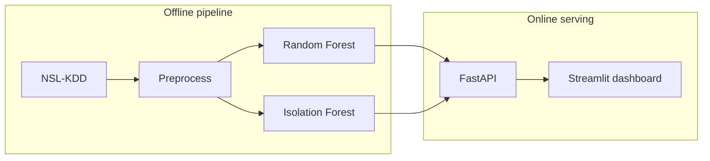

# NetGuard-AI

**AI-powered Intrusion Detection System** — supervised multi-class detection + unsupervised anomaly scoring, served through a FastAPI inference API and a live Streamlit operations dashboard.

Built as a production-style portfolio project for graduate study in cybersecurity (software engineering + ML + threat detection).

## Features

| Capability | Implementation |
|------------|----------------|
| Supervised IDS | Random Forest (optional XGBoost) on NSL-KDD: `normal`, `dos`, `probe`, `r2l`, `u2r` |
| Anomaly detection | Isolation Forest trained **only on normal** traffic |
| Feature pipeline | One-hot categoricals + standard scaling; fit on train only |
| Inference API | FastAPI: `/health`, `/predict`, `/metrics` |
| Dashboard | Streamlit: metrics, demo traffic scans, alert feed |
| Quality | `pytest`, YAML config, MIT license |
| Deploy | Docker Compose (API + dashboard) |

## Results (NSL-KDD test+)

Evaluated on **KDDTest+** (22,544 flows; includes attacks not seen in training).

| Model | Metric | Value |
|-------|--------|------:|
| Random Forest (supervised) | Accuracy | **0.747** |
| Random Forest | F1 weighted | **0.701** |
| Random Forest | F1 macro | 0.517 |
| Isolation Forest (anomaly) | F1 | **0.823** |
| Isolation Forest | ROC-AUC | **0.946** |

Per-class F1 is strongest on DoS / Probe / Normal; R2L / U2R remain rare-class challenges. Full report: `models/artifacts/metrics.json` (regenerated by `python scripts/train.py`).

## Architecture



```
NetGuard-AI/
├── api/                  # FastAPI inference
├── dashboard/            # Streamlit UI
├── config/settings.yaml  # Runtime & training knobs
├── src/netguard/         # preprocess, train, predict
├── scripts/              # download_data, preprocess, train
├── models/artifacts/     # local *.joblib + tracked metrics.json
├── data/                 # raw/processed (contents gitignored)
├── tests/
├── Dockerfile
└── docker-compose.yml
```

## Tech stack

Python 3.11+ · scikit-learn · pandas · FastAPI · Streamlit · Docker  
Licenses: MIT / Apache-2.0 / BSD only (no GPL/AGPL).

## Screenshots


## Quick start

### Windows helpers

```bat
run_step2.bat    # venv, install, download NSL-KDD, preprocess, test
run_step3.bat    # train models
start_api.bat    # Terminal 1 — keep open (http://127.0.0.1:8000)
run_step5.bat    # Terminal 2 — dashboard (http://localhost:8501)
```

### Manual

```bash
python -m venv .venv
source .venv/bin/activate   # Windows: .venv\Scripts\activate
pip install -r requirements.txt && pip install -e .

python scripts/download_data.py
python scripts/preprocess.py
python scripts/train.py
pytest

uvicorn api.main:app --host 127.0.0.1 --port 8000
streamlit run dashboard/app.py
```

## Inference API

| Method | Path | Description |
|--------|------|-------------|
| GET | `/health` | Liveness + model load status |
| GET | `/metrics` | Training evaluation JSON |
| POST | `/predict` | Feature dicts → class + anomaly score |

Interactive docs: http://127.0.0.1:8000/docs

```bash
curl -X POST http://127.0.0.1:8000/predict \
  -H "Content-Type: application/json" \
  -d '{"flows":[{"protocol_type":"tcp","service":"http","flag":"SF","src_bytes":100,"dst_bytes":200}]}'
```

## Docker

Train locally first so `data/processed/` and `models/artifacts/` exist, then:

```bash
docker compose up --build
# or: run_docker.bat
```

Artifacts are volume-mounted (not baked into the image). Dashboard uses `NETGUARD_API_BASE_URL=http://api:8000`.

## Security & responsible use

- Educational / portfolio IDS on public **NSL-KDD** data  
- Default demo does **not** sniff live packets  
- `/predict` accepts feature dictionaries only  
- Capture live traffic only on networks you own or are authorized to monitor  
- Large raw data and `.joblib` models are gitignored — clone and re-run Steps 2–3

## What this demonstrates

1. **Cybersecurity** — NSL-KDD taxonomy, attack families, train/test novelty gap  
2. **Applied ML** — supervised + anomaly paths, leakage-aware preprocessing  
3. **Software engineering** — modular package, REST API, tests, Docker  
4. **Ops mindset** — health checks, metrics endpoint, live alert feed  

## License

MIT — see [LICENSE](LICENSE).
